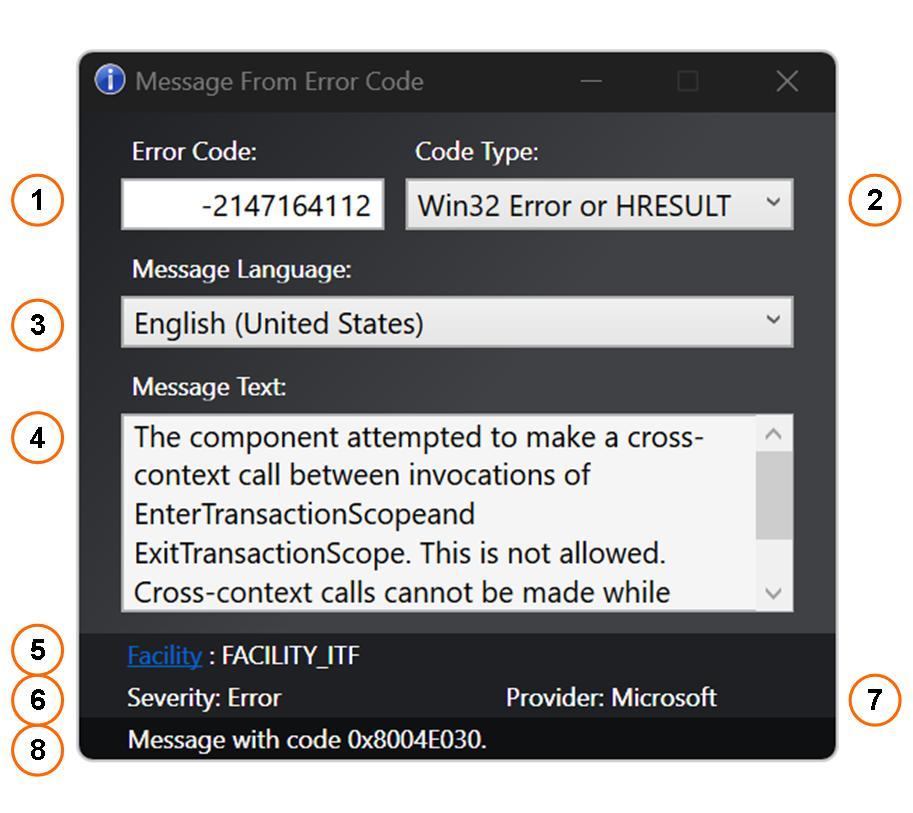

## **Message From Error Code**  

Windows PowerShell GUI to get the message text belonging to an error code received from Windows API functions, program exceptions or crashes.  
 

### **Interface:**  

  

| **Element** | **Description** |
| :---: | :--- |
| 1 | Enter the Windows error code as - (sign prefixed) decimal integer, or - `0x` prefixed hexadecimal number |
| 2 | Choose the type of the entered code. Supported types are - Undecorated Win32 error codes or HRESULT values - NTSTATUS values - NTSTATUS values that have been turned into a HRESULT by adding the `N` bit|
| 3 | Choose the language in which you want the message to be displayed. The current user interface language is pre-selected. However, you may want to use `English (United States)` to display the original English messages since translations might be incorrect or ambiguous. The dropdown list contains only languages for which the related Multilingual User Interface file is found on the system. |
| 4 | Output of the message text associated with the entered error code. Sources of those messages are libraries and MUI files belonging to the Windows system. |
| 5 | The facility constant indicates the source of the error. Common facility values are described in the Microsoft docs. You may click on the blue hyperlink to navigate to the online table for the selected code type. `FACILITY_WIN32` is shown for both undecorated Win32 error codes and HRESULT values derived from Win32 error codes. |
| 6 | Severity associated with the code. While for HRESULT values only `Success` and `Error` are defined, the severity of NTSTATUS values can be `Success`, `Informational`, `Warning` or `Error`. |
| 7 | Provider of the error code. The HRESULT and NTSTATUS numbering systems are vendor-extensible. If the the value is Microsoft-defined or belongs to the numbering space that is reserved for Microsoft-defined values, the provider is shown as `Microsoft`. If the value is in the customer-defined numbering space, the provider is shown as `customer`. |
| 8 | The status bar repeats the input as 8-digit hexadecimal value if it was convertible to a 32-bit integer. This is the formatting used for the error codes in the Microsoft docs. |

 
